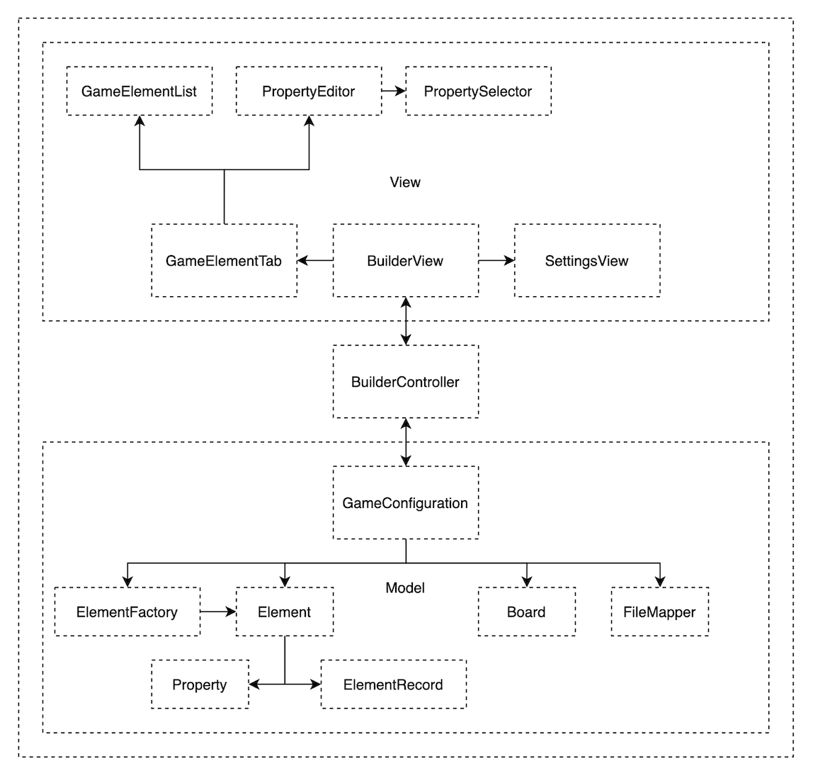
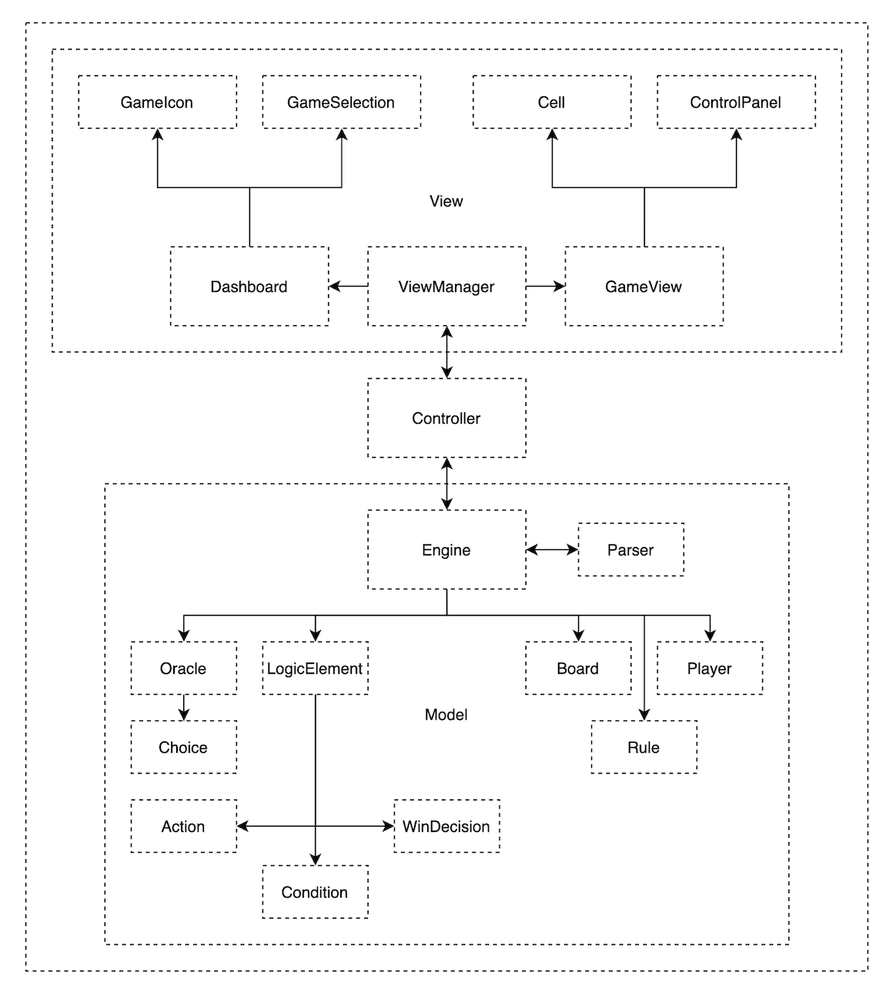

# OOGABOOGA Final Presentation

## Demo

### Game Player

#### Example Games

* Tic-Tac-Toe
  * Show winning and losing
* Checkers
  * Save and restart from that point
  * Play Tic Tac Toe at the same time
  * Alex: AI Player - show the available options/difficulties and demonstrate AI making moves in Checkers
* Minesweeper
  * Different Color Themes and Languages
* Wordle
  * Display High Scores
  
### Authoring Environment
* Load in checkers and make 3 edits
  * Remove Last Row of Pieces
  * Add Capturing of own pieces
  * Add win condition for reaching other side of board
* Create Simple Piece Placement Game
* Data Files
  * Essential - Internal properties files describe the available Game Elements
  * User Created - Game Configuration Folder
    * JSON Game configuration
    * Resources Folder
    * Game Icons

### Tests
* Run all tests, verifying that they pass
* Describe Tests
  * Alex: Happy AI Test:
    * ```java
      @Test
  void emptyBoardEvaluation() { }

  @Test
  void fullOneSidedBoardEvaluation() { }

  @Test
  void testSplitBoard() { }

  ```
    * Sad Board Test:
      ```java
  @ParameterizedTest
  @MethodSource("testErrorsSource")
  void testErrors(Tuple3<Board, Integer, Integer> vals) {}
  ```
  * Frontend TestFX - TODO
  * Integration Tests - Game Configuration Saving/Loading

## Design

### High Level Design

#### Builder



#### Engine




### Design Goals: Flexibility 

The design is as flexible as we wanted it to be.

In the engine, the system of Actions, Conditions, and WinDecisions
follows a clear inheritance hierarchy with public APIs that define how these elements interface with
each other. The creation of new game elements is very easy with this system, meaning it is open to 
extension.

Likewise in the builder, adding new game elements and types of game elements is as simple as 
implementing the corresponding API. These APIs are closed for modification, as their method 
signature should not change. Concrete classes are not referenced anywhere in the code, adding 
flexibility.

### APIs

#### JSONSerializable and JSONParseable

This API (made of two interfaces) describes methods for serializing and parsing GameElements in the 
Builder to their JSON format. We decided to split the Interface into two, because certain elements
are serializable but not parseable.

```java
/**
 * API For adapting Back-End Objects to their JSON Format
 *
 * @author Shaan Gondalia
 */
public interface JSONSerializable {

  /**
   * Converts the object into a String representing the object's JSON Format
   *
   * @return a String representation of the objects JSON Format
   */
  String toJSON();

}

/**
 * API for converting a json string to an Object
 *
 * @author Shaan Gondalia
 */
public interface JSONParseable<T> {

  /**
   * Converts a json string to an object of type T
   *
   * @param json a json string
   * @return an object of type T built from the json String
   */
  T fromJSON(String json) throws Exception;

}
```

###### Open/Closed Principle
The interfaces are generic, meaning they can be applied to any class. Their method signatures 
are primitive types and generics, so they are not implementation specfic.

###### Supports Readable and Well Designed Code
Instead of having a single Parsing Object responsible for knowing how to parse/serialize each
class in the game, we can define how classes are parsed and serialized in the class itself. These
classes are now more active.

###### Changes
It was split into two, originally it was just JSONSerializable which held the toJSON and fromJSON
  methods.

###### Use Cases

1. Loading an entire game configuration:

In Controller
```java
Void load(LoadCallback callback) {
    LOG.info("Attempting to load configuration from folder {}", callback.directory().getAbsolutePath());
    File configFile = new File(callback.directory().toString() + JSON_FILENAME);
    try {
        InputStream is = new DataInputStream(new FileInputStream(configFile));
        JSONTokener tokener = new JSONTokener(is);
        JSONObject object = new JSONObject(tokener);
        gameConfig.fromJSON(object.toString(), callback.directory().toString());
    } catch (FileNotFoundException e) {
        throw new RuntimeException(e);
    }
    LOG.info("Successfully loaded {}", gameConfig.getElementNames(GameConfiguration.METADATA).stream().findFirst().orElse("Untitled"));
    return null;
}
```
In GameConfiguration
```java
public void fromJSON(String json, String workingDirectory) {
  JSONObject obj = new JSONObject(json);
  board = new RectangularBoard(0, 0).fromJSON(obj.getJSONObject("board").toString());
  resetElements();
  try{
    for (String key : Collections.list(resources.getKeys())) {
      addJSONArray(obj.getJSONArray(resources.getString(key)), key, workingDirectory);
    }
    addJSONObject(obj.getJSONObject(METADATA), METADATA, workingDirectory);
  } catch (JSONException e) {
    throw new MalformedConfigurationException(e);
  }
}

// Adds the contents of a json array to the map of game elements
private void addJSONArray(JSONArray arr, String type, String workingDir) {
  for (int i = 0; i < arr.length(); i++) {
    JSONObject obj = arr.getJSONObject(i);
    addJSONObject(obj, type, workingDir);
  }
}

// Adds the contents of a json object to the map of game elements
private void addJSONObject(JSONObject obj, String type, String workingDir) {
  if (obj.has(NAME)) {
    GameElement element = provider.fromJSON(type, obj.toString());
    Collection<Property> resolvedProperties = mapper.resolveResourcePaths(element.toRecord()
        .properties(), workingDir);
    addGameElement(type, element.toRecord().name(), resolvedProperties);
  }
}

```

2. Saving an entire game configuration:

In Controller
```java
Void save(SaveCallback callback) throws NullBoardException {
    LOG.info("Attempting to save configuration to folder {}", callback.file().getAbsolutePath());
    File configFile = new File(callback.file().toString() + JSON_FILENAME);
    try {
        FileWriter writer = new FileWriter(configFile);
        writer.write(gameConfig.toJSON());
        writer.close();
        gameConfig.copyFiles(callback.file());
    } catch (IOException e) {
        throw new RuntimeException(e);
    }
    LOG.info("Successfully saved {}", gameConfig.getElementNames(GameConfiguration.METADATA).stream().findFirst().orElse("Untitled"));
    return null;
}
```
In GameConfiguration
```java
public String toJSON() throws NullBoardException, ElementNotFoundException {
  checkBoardCreated();
  JSONObject obj = new JSONObject();
  obj.put(METADATA, metaDataToJSON());
  obj.put(BOARD, new JSONObject(board.toJSON()));
  for (String key : Collections.list(resources.getKeys())) {
    obj.put(resources.getString(key), elementsToJSONArray(key));
  }
  return obj.toString(INDENT_FACTOR);
}

// Converts all elements of a certain type to a JSONArray
private JSONArray elementsToJSONArray(String type) throws ElementNotFoundException {
  JSONArray arr = new JSONArray();
  if (!elements.containsKey(type)) {
    return arr;
  }
  for (GameElement element : elements.get(type).values()) {
    ElementRecord record = element.toRecord();
    arr.put(new JSONObject(record.toJSON()));
  }
  return arr;
}
```
In ElementRecord
```java
public String toJSON() {
  JSONObject obj = new JSONObject();
  for (Property property : properties) {
    obj.put(property.name(), property.value());
  }
  obj.put(NAME, name);
  return obj.toString();
}
```

#### Alex: AI - Interface of Selects & State Evaluator
* Show the public methods for the API
  * 
```java
@FunctionalInterface
public interface Selects {

AIChoice selectChoice(Board board, int forPlayer);

}

@FunctionalInterface
public interface StateEvaluator {

Evaluation evaluate(Board board);

static void throwIfInvalid(Board board) {
if (board == null) {
throw new InvalidBoardException();
}
}

}

  ```
* How does it provide a service that is open for extension to support easily adding new features?
* How does it support users (your team mates) to write readable, well design code?
* How has it changed during the Sprints (if at all)?

###### Use Cases

* Show two Use Cases implemented in Java code in detail that show off how to use each of the APIs described above
    * Use Case 1: AI Player using Selects
```java
public AIChoice chooseAction(Board board) {
        return selector.selectChoice(board, this.playerNumber);
}


```
    * Use Case 2: Selects using StateEvaluator

```java

protected Evaluation getEvaluation(Board board) {
        return getStateEvaluator().evaluate(board);
        }

protected StateEvaluator getStateEvaluator() {
        return this.stateEvaluator;
        }

```
    
### Designs

#### Stable - Property
* Properties have a name, value, default value, and "form" (which indicates how the property is displayed)
* Different subclasses of Property have different types for the value using generics
* Properties are immutable
  * Convenience methods to create copies of a property but with a different value or different value and name, etc
* The value and default value of the property are stored as actual objects internally, but they can be converted to and from strings

#### Significantly Changed - Immutable Boards

 * Immutable boards in the backend is the board on to which pieces can be added
 * Has Rows, Column, Current player
 * Changed from mutable to immutable so that board can not be forcefully changed by accessing a public method
## Team

### What we learned from the Agile Process

### What we learned from trying to manage such a large project

### What we learned about creating a positive team culture

### What we learned about communication and collective problem solving